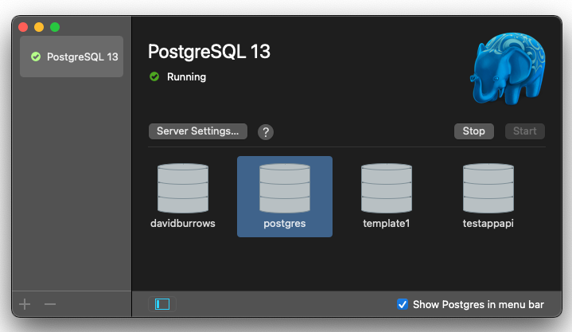

# Teaching App

App for teaching basic backend dev using minimal dependencies/frameworks.

## Setup

Install nodemon globally, run install, then you should be good to go.

```js
npm install -g nodemon
npm install
node ./index.js
```

### Database Setup

Install Postgres using Postgres.app - <https://postgresapp.com/downloads.html>

Start Postgres.app, then double click on the postgres database icon to get a terminal prompt in psql (you should see `postgres=>` in the prompt)



```bash
# create new user
CREATE ROLE testappuser WITH LOGIN PASSWORD 'test123';

# add CREATEDB permission
ALTER ROLE testappuser CREATEDB;

# logout
\q
```

now you've logged out, login with the new user

```bash
psql -d postgres -U testappuser
```

now run

```bash
# create database
CREATE DATABASE testappapi;

# connect to our new db
\c testappapi

# create a table to store our posts
CREATE TABLE posts (
  ID SERIAL PRIMARY KEY,
  title TEXT NOT NULL,
  content TEXT
);

# add a couple of posts to get us started
INSERT INTO posts (title, content)
  VALUES ('First Post', 'this is the first post'), ('Another Post', 'this is another post with some more text');

# check we've created the posts
select * from posts;
```

If you don't have postgres follow https://postgresapp.com/documentation/cli-tools.html to add the command line utilities to your path

Note: if you have homebrew postgres (or any other postgres installation) installed as well you might need to run this from the postgres.app folder e.g. `/Applications/Postgres.app/Contents/Versions/latest/bin/psql`

If you do need to do this it's useful to add an alias to your shell (.bashrc or .zshr) of `alias psqlapp="/Applications/Postgres.app/Contents/Versions/latest/bin/psql"`

## Debugging

This project is setup to run a debug mode in VSCode using nodemon, just hit the start button in the 'Run and Debug' section.

## Docs

Express - <https://expressjs.com/>
Nodemon - <https://github.com/remy/nodemon>
Cookie Parser - <https://github.com/expressjs/cookie-parser>
